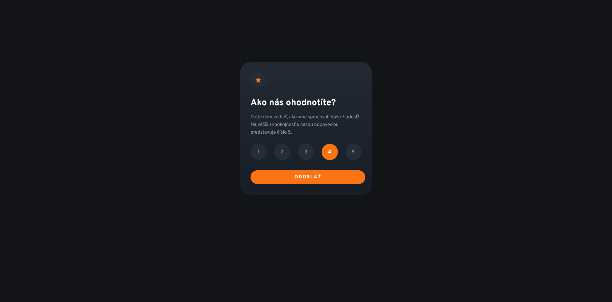
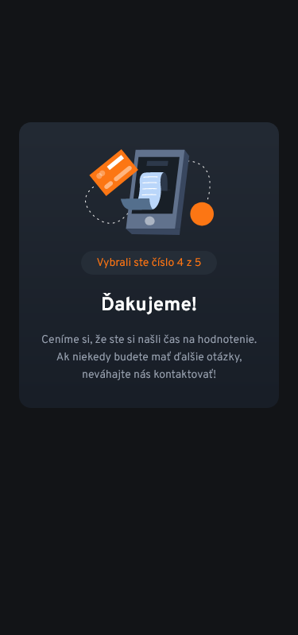

# Frontend Mentor - Interactive rating component

## 📝 Informácie o projekte

Tento projekt je zo stránky [Frontend Mentor](https://www.frontendmentor.io/challenges/interactive-rating-component-koxpeBUmI). Stránka Frontend Mentor ponúka projekty na vypracovanie, ktoré obsahujú základný text v HTML a grafický dizajn projektu vo Figme.

Používatelia tejto stránky môžu:

- zvoliť hodnotenie a po odoslaní sa zobrazí poďakovanie a zvolené ohodnotenie
- vidieť interaktívne prvky pri prechádzaní stránkou
- prezerať si stránku na desktope alebo na mobilnom zariadení

Po kliknutí na kruh s hviezdičkou sa zobrazí môj predchádzajúci projekt zo stránky [Frontend Mentor](https://www.frontendmentor.io/solutions/my-version-article-preview-component-zB4uukJR93).

#### [Odkaz na hotovú stránku](https://tomasdunik.github.io/frontend-mentor__interactive-rating-component/)

 

## 🏗️ Vytvorenie projektu

<!-- Projekt som vytvoril približne za 5 hodín a 55 minút (čas od stiahnutia projektu až po jeho finálne publikovanie na stránke Frontend Mentor). Použil som HTML,CSS a Sass. Projekt má dizajn pre pre desktop a mobil. Najviac času mi zabralo vytvorenie responzívneho dizajnu. Prvýkrát som robil responzívny dizajn pre tri zariadenia - desktop, tablet a mobil. Anglické texty som upravil na slovenské. -->

Projekt som vytvoril približne za 4 hodiny (čas od stiahnutia projektu až po jeho finálne publikovanie na stránke Frontend Mentor). Na vytvorenie stránky som použil HTML, CSS, SCSS a JavaScript. Projekt má dizajn pre pre desktop a mobil. Anglické texty z projektu som prepísal na slovenské.

 

## 🛠️ Vytvorené s

- HTML
- CSS
- SCSS
- JavaScript

 

## 📸 Screenshots

### 💻 Desktop

### 📱 Mobil

 

## 🔗 Projekty Frontend Mentor

- [Tento konkrétny projekt na stránke Frontend Mentor](https://www.frontendmentor.io/solutions/my-version-interactive-rating-component-aRiFGLiZ12)
- [Moje ostatné projekty na stránke Frontend Mentor](https://www.frontendmentor.io/profile/WeekendsProgrammer)
